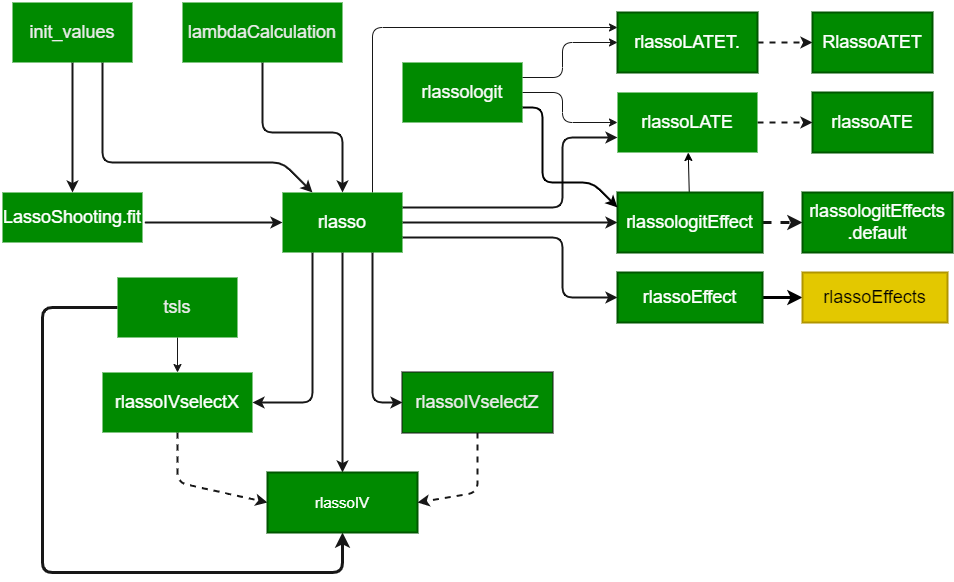

# hdmjl
The hdmjl package is a port of parts of the R package hdm translated into Julia.

The following is the graph of the functions we are currently working on. It will change as we add more functions:

